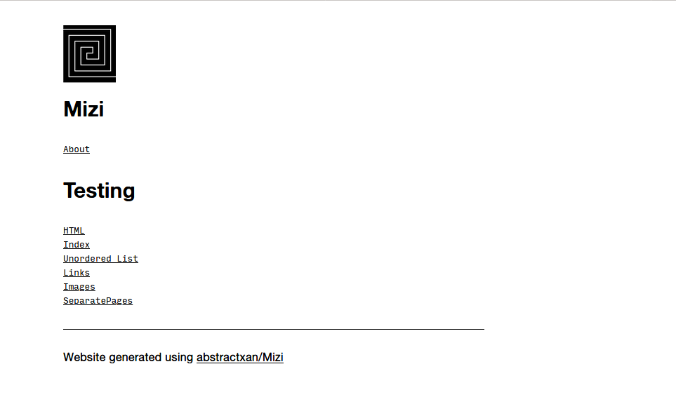

# Mizi


A simple static website generator written in C++ that takes markdown format as input. 

Inspired from [hundredrabbits/100r.co](https://github.com/hundredrabbits/100r.co)

Created for my website [abstractxan.xyz](https://abstractxan.xyz)

Sample generated repo here : [mizi.netlify.com](https://mizi.netlify.com) 

[](https://app.netlify.com/sites/mizi/deploys)

## Download and run
- Clone / Download this repository
- Update `src/config.conf` for your webpages
- Update `src/website.md`
- Build using `./build.sh` or Run `./src/mizi` to create site
- Open `index.html` which opens `site/home.html`


## Currently supported features:

1. Inputs a single markdown file as input
2. Configurable `<head>` and header and footer for every page
3. Create reusable components using templates by updating `templates.conf`


``` md
# Category
## Page
### Section
- First
- Second
- Third
<p>Could write in HTML too!</p>
Inline [links!](https://abstractxan.xyz)
Inline images 

$$$ Seperate Pages
## Seperate Page
### Section
Text

{{Template Arg1 Arg2}}
```

- A `config.conf` file for `<head>` , header and footer
- Templating feature through `template.conf`

## Contribute
Open a new issue for bug / feature requests. PRs are welcome.

