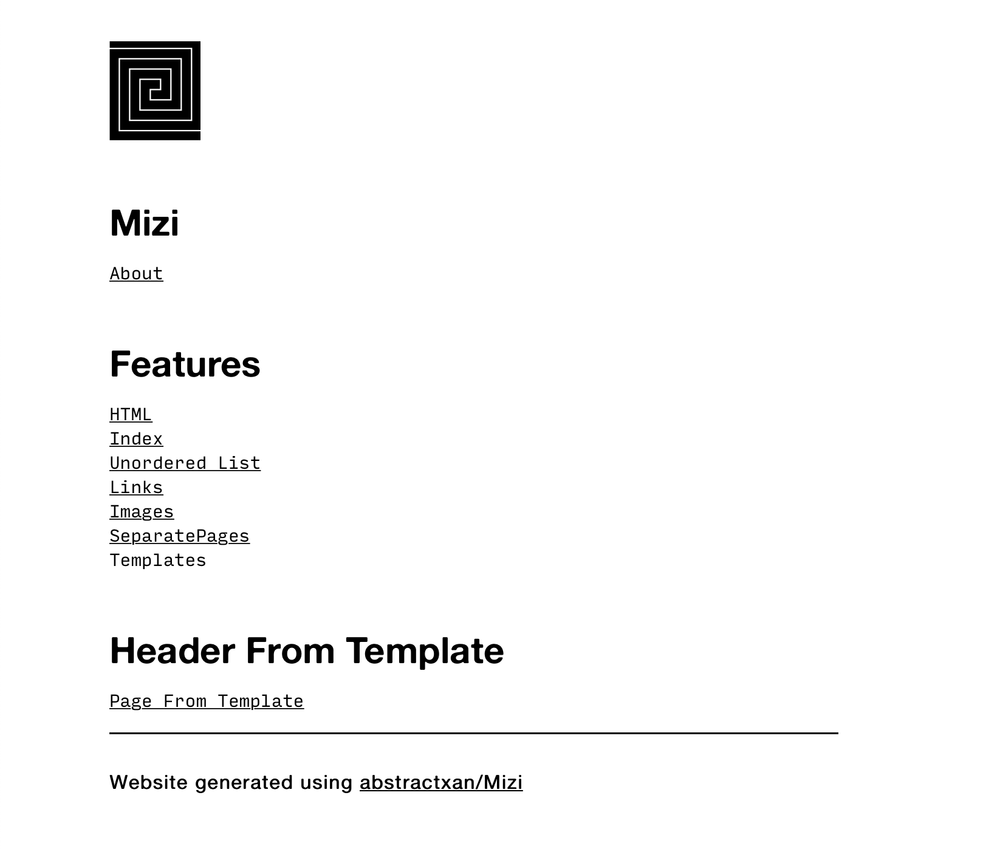

# Mizi


A simple static website generator written in C++ that takes markdown format as input. 

Inspired from [hundredrabbits/100r.co](https://github.com/hundredrabbits/100r.co)

Created for my website [abstractxan.xyz](https://abstractxan.xyz)

Sample generated repo here : [mizi.netlify.com](https://mizi.netlify.com) 

[](https://app.netlify.com/sites/mizi/deploys)

## Download and run
- Clone / Download this repository
- Move into `src` by doind `cd src`
- Update `src/config.txt`
- Update `src/website.md`
- Build using `./build.sh` or Run `./mizi` to create site
- Go up a directory `cd ..`
- Open `index.html` which essentially opens `site/home.html`


## Currently supported format

- A config file for `<head>` , header and footer

``` md
# Category
## Page
### Part
- First
- Second
- Third
<p>Could write in HTML too!</p>
Inline [links!](https://abstractxan.xyz)
Inline images 

$$$ Seperate Pages
## Seperate Page
### Part
Text
```

## Todo

``` md
- add template engine
- setup better unit testing functionality
- fix url and image parsing code by split string
- adding classes to images
```

## Contribute
Open a new issue for bug / feature requests. PRs are welcome.

